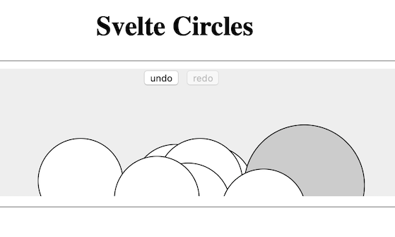

# svelte-happy-demo

A playground for developing _interactive_ SVG graphics, as a Svelte component.

Aims:

- [ ] apply the Toolbook/Flash programming model to modern web apps
   - [ ] vector graphics with scripts and cascading events
- [ ] allow working with SVG assets in separate files (editable)
- [ ] ... (other aims still foggy)

[HTML 5 SVG page](https://www.w3schools.com/html/html5_svg.asp) (w3schools) mentions that SVG were "not suited for game applications". One of the purpose of this demo is to see, how far that holds true, in 2019-20.


## Requirements

- npm

## Getting started

```
$ npm install
```

*If you see errors, check out the [Troubleshooting](#troubleshooting) section.*

```
$ npm run dev

  Your application is ready~! 🚀

  - Local:      http://localhost:5000

...
[2019-11-24 19:42:02] waiting for changes...
```

Open [http://localhost:5000](http://localhost:5000).


>


## Tests

<font color=red>tbd. Tests are intended, using Mocha, Puppeteer or similar (what is this C... fellow?).</font>


## Developing

While you're running the `npm run dev`, changes to the code are reflected in the browser.

>You will need to hit 'refresh' in the browser, though. Remains open whether we want the browser to automatically refresh - it may also be a unwanted.


## Using

>This module is not currently published to the online `npm` repo. This is because it's a proof-of-concept and not really useful as from-the-shelf. If this changes, we may rethink polishing and publishing.

To use the component in your other (npm) project, use:

Here, just once:

```
$ npm link
```

In the using project:

```
$ cd <your-project>
$ npm link svelte-circles-demo	# the name in 'package.json'
```

This should provide you the component in the other project. 

*<font color=red>Warning: not tried!</font>*

<!-- see here if there are problems:   #remove when works
https://docs.npmjs.com/cli/link.html
-->

See [app/App.svelte](app/App.svelte) for a sample.

<!-- disabled (enable if there are properties)
### Properties
 
| | Default Value | Description
|---|---|---

-->


## Troubleshooting

### macOS Catalina

If you're on macOS 10.15 and get a bunch of errors about `node-gyp`, see [here](https://github.com/nodejs/node-gyp/issues/1927#issuecomment-549349352).

Essentially: 

>```
>$ sudo rm -rf $(xcode-select -print-path)
>$ xcode-select --install
>$ /usr/sbin/pkgutil --packages | grep CLTools   # should list some files
>```

Then try again `npm install`.

## References

- Thanks to Eugenkiss [7 Tasks](https://eugenkiss.github.io/7guis/tasks#circle) for the original "Circle Drawer" code, found via [Svelte Examples](https://svelte.dev/examples#7guis-circles)

- [rollup-plugin-svelte/README](https://github.com/rollup/rollup-plugin-svelte)

	Read especially [this section](https://github.com/rollup/rollup-plugin-svelte#pkgsvelte) for knowledge on exporting/importing Svelte components, via npm.

- [lukeed/svelte-demo](https://github.com/lukeed/svelte-demo) used as a template for the `app` part (demo/testbed)

- [Understanding npm-link](https://medium.com/dailyjs/how-to-use-npm-link-7375b6219557) (Medium; Oct 2018)